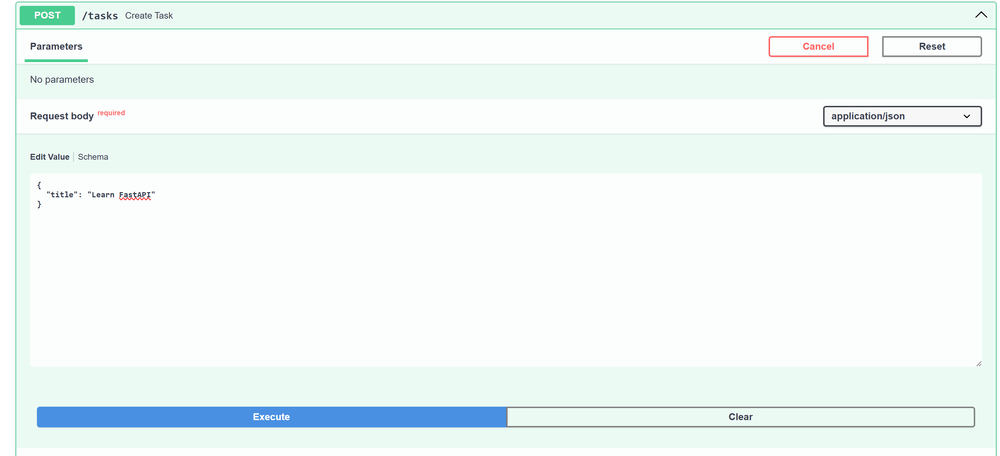
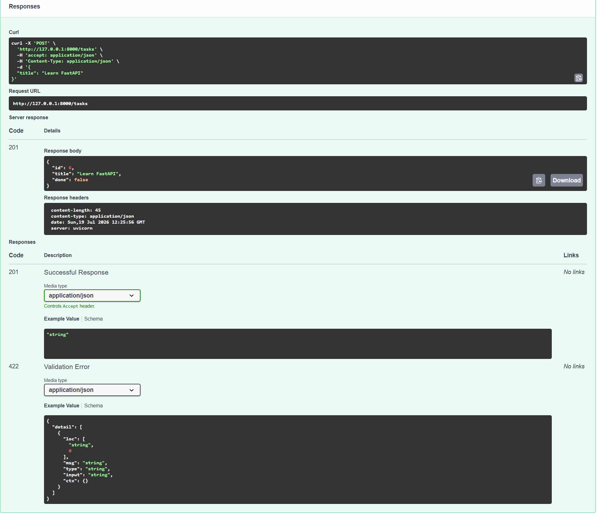

# Task API

## Description

Task API is a simple CRUD (Create, Read, Update, Delete) application built using **FastAPI**. It allows users to create, view, update, and delete tasks. The project stores data in memory and provides interactive API documentation through Swagger UI.

---

## Technologies Used

- Python 3
- FastAPI
- Uvicorn
- Git
- GitHub

---

## Installation

### Clone the repository

```bash
git clone https://github.com/sanjureddy17/task-api.git
```

### Move into the project folder

```bash
cd task-api
```

### Install dependencies

```bash
pip install fastapi uvicorn
```

### Run the application

```bash
python -m uvicorn main:app --reload
```

The server will start at:

```
http://127.0.0.1:8000
```

---

## Swagger Documentation

Open the following URL in your browser:

```
http://127.0.0.1:8000/docs
```

---

## API Endpoints

| Method | Endpoint | Description |
|--------|----------|-------------|
| GET | / | Home endpoint |
| GET | /health | Health Check |
| GET | /tasks | Get all Tasks |
| GET | /tasks/{task_id} | Get Task by ID |
| POST | /tasks | Create a New Task |
| PUT | /tasks/{task_id} | Update an Existing Task |
| DELETE | /tasks/{task_id} | Delete a Task |

---

## Sample cURL Command

```bash
curl -X GET http://127.0.0.1:8000/tasks
```

### Example Response

```json
[
  {
    "id": 1,
    "title": "Study Python",
    "done": false
  }
]
```

---

# Screenshots

## Swagger UI

The Swagger UI automatically documents all the API endpoints and allows interactive testing.


---

## API Test Examples

### GET /tasks

The following screenshot shows the successful execution of the **GET /tasks** endpoint.


---

### POST /tasks

The following screenshots show the request used to create a new task and the successful response returned by the API.

#### POST Request



#### POST Response



---

## Author

**Sanjana**