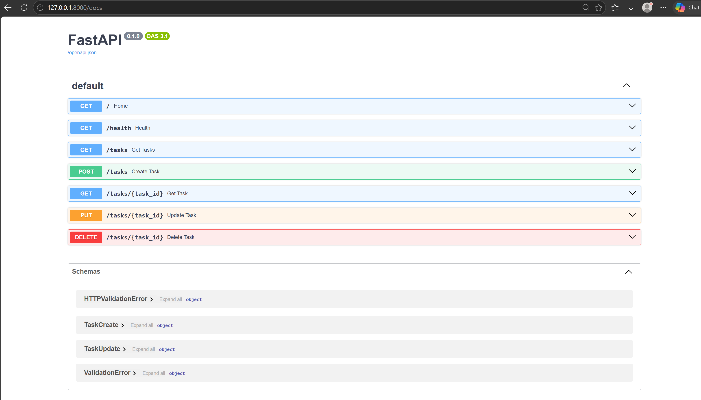
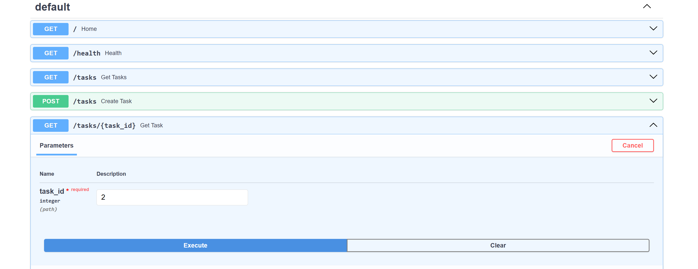
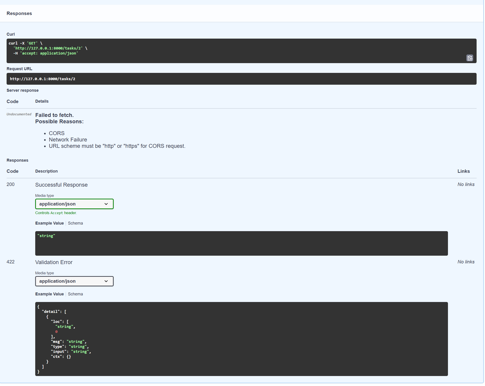
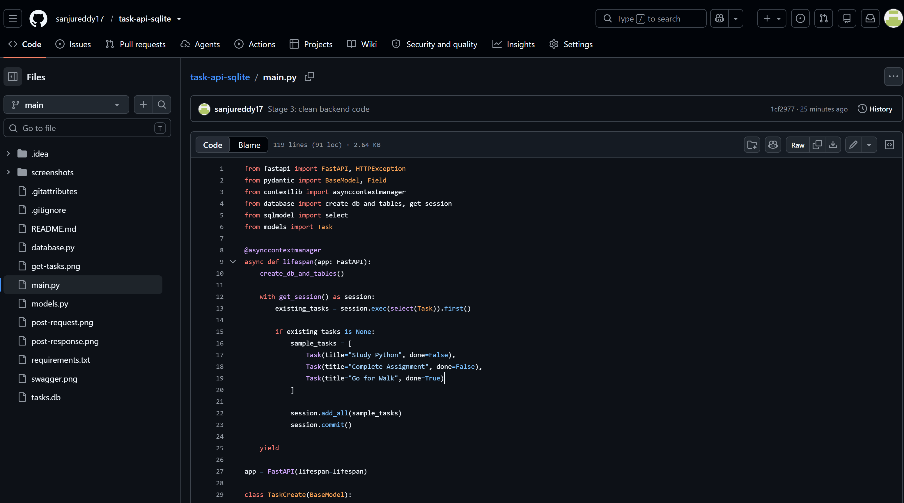

# Task API - FastAPI + SQLite

A simple backend Task Management API built using FastAPI and SQLite.

This project was developed as part of the Backend AI Engineering Internship assignment (BE-01: Build Your First API Endpoint).

## Tech Stack

- Python
- FastAPI
- SQLModel
- SQLite
- Uvicorn

## Features

- Create tasks
- View all tasks
- View task by ID
- Update tasks
- Delete tasks
- SQLite database storage
- REST API with Swagger documentation

## Project Setup

### Install Dependencies

```bash
pip install -r requirements.txt

## Screenshots

### Swagger API Documentation


### API Request


### API Response


### GitHub Repository
